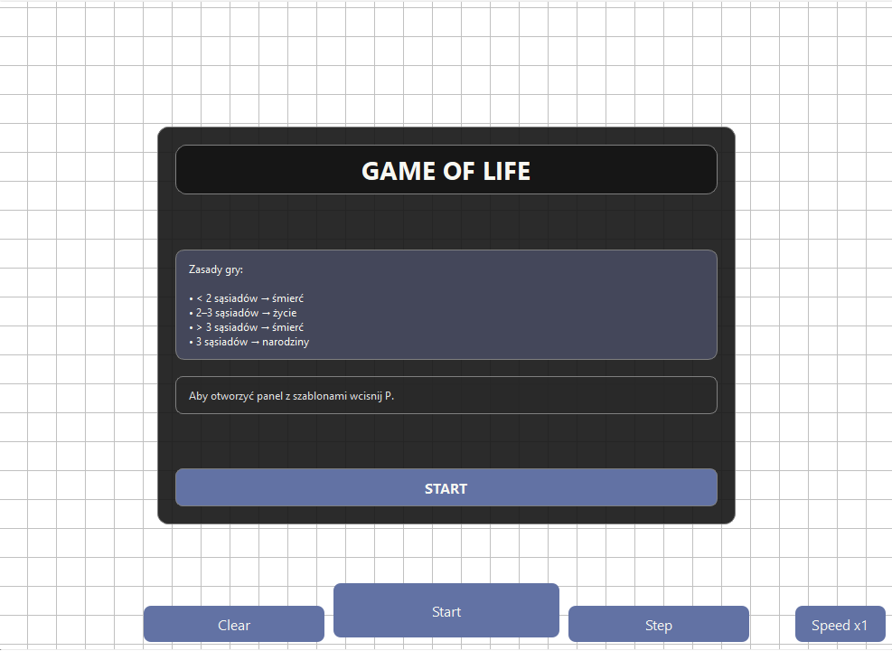
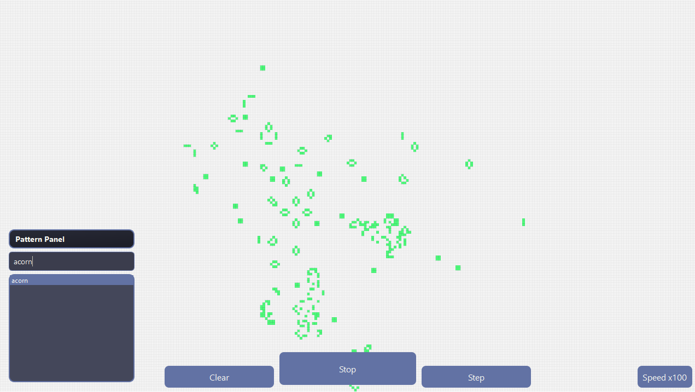

# 🧬 Conway's Game of Life – Qt C++

A Conway’s Game of Life simulator built using C++ and the Qt framework, featuring JSON-based pattern loading.

---

## 📌 Description

This project is a desktop implementation of Conway’s Game of Life created with Qt and C++.  
The application allows users to run simulations, import patterns using JSON files.

---

## ⚙️ Features

- Conway’s Game of Life simulation
- Interactive Qt GUI
- Start / pause / reset simulation controls
- Adjustable simulation speed
- Load patterns from JSON files
- Save custom patterns to JSON
- Import predefined structures into the grid
- Dynamic grid rendering and updates

---

## 🧠 Simulation Rules

The simulation follows the classic Conway’s Game of Life rules:

- Any live cell with fewer than 2 neighbors dies
- Any live cell with 2 or 3 neighbors survives
- Any live cell with more than 3 neighbors dies
- Any dead cell with exactly 3 neighbors becomes alive

---

## 🎨 User Interface

- Qt Widgets based interface
- Interactive simulation grid
- Dark themed UI
- Real-time simulation rendering

---

## 🛠️ Technologies

- C++
- Qt (Widgets)
- JSON file operations
- Qt Creator

---

## 📸 Screenshots

### Main Window

### Running Simulation

---

## 📌 Notes

This project was created to practice:
- Qt desktop application development
- Cellular automata simulation
- JSON serialization and parsing
- Real-time grid rendering
- Object-oriented programming in C++

---

## 👨‍💻 Author

C++ / Qt developer focused on simulation systems, algorithms, and desktop applications.